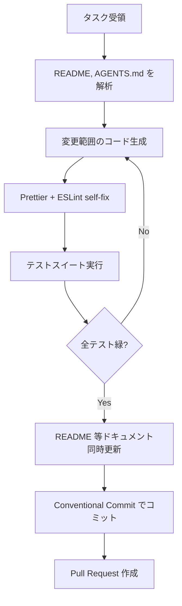

# AGENTS.md

## このドキュメントの目的

本ファイルは **日本語AI エージェント（例: GitHub Copilot Chat, OpenAI Codex, など）** がリポジトリを解析し、コード生成・修正・Pull Request 作成を行う際の行動指針を明示的に提供するものです。人間開発者にとっては開発規約の集約ドキュメント、エージェントにとってはプロンプトの一部として読み込まれる"仕様書"となります。

- **何のために？** リポジトリの一貫性を保ち、無駄なレビューコストを削減するため。
- **何をする？** コーディングスタイル、テスト手順、ビルド／デプロイ、ドキュメント更新規定、コミット規約を宣言的に定義します。

---

## プロジェクト概要

| 項目     | 内容                                              |
| ------ | ----------------------------------------------- |
| プロダクト名 | **リペインター** ― 描くたびにモチーフが消える線画練習 Web アプリ          |
| 主機能    | 画像アップロード／キャンバス描画（描画中のモチーフ自動非表示・透明度調整）           |
| デプロイ方法 | GitHub Pages (`docs/` ディレクトリ)                   |
| 主要ファイル | `index.html`, `style.css`, `script.js`, `docs/` |
| 使用技術   | HTML, CSS, JavaScript (ブラウザネイティブ Canvas API)    |
| 対象ブラウザ | 最新版 Chrome / Firefox / Safari / Edge            |

> **備考**: README は機能仕様書として位置づけています。コードを変更する場合は README も同時に更新してください。

---

## ディレクトリ適用スコープ

- **ルート **``** (本ファイル)**: プロジェクト全体に適用される最低限の規約を定義
- **サブディレクトリ **``: 必要に応じてドメイン固有の規約を上書き可（例:`docs/` 以下で別ビルドフローを持つ場合）

---

## 1. コーディングスタイル

| 規約    | 設定                |
| ----- | ----------------- |
| インデント | 2 スペース固定 (Tab 禁止) |
| 文字コード | UTF-8 (BOM なし)    |
| 改行コード | LF                |
| セミコロン | 行末に必ず付与           |
| 引用符   | シングルクォート `'` を使用  |
| 最大行長  | 120 文字            |

### 自動フォーマッタ / 静的解析

| ツール                       | コマンド例                                       |
| ------------------------- | ------------------------------------------- |
| **Prettier**              | `npx prettier --write "**/*.{js,css,html}"` |
| **ESLint (標準 + browser)** | `npx eslint . --fix`                        |

エージェントは **コード生成前に** Prettier 規約を内部プロンプトへ組み込み、**コミット前に** `npm run lint` を実行してから PR を作成してください。

---

## 2. テストと品質保証

このリポジトリは現時点で自動テストを備えていませんが、以下を目標とします。

1. **ユニットテスト**: [Vitest](https://vitest.dev/) + [Happy DOM](https://github.com/capricorn86/happy-dom) を採用予定。
2. **カバレッジ閾値**: 80% 以上。
3. **CI 実行**: GitHub Actions で `npm run test` を走らせ、失敗時は PR を赤色のままにする。

> エージェントがテストコードを追加・更新した場合、README の "テスト" 節を同時に更新してください。

---

## 3. ビルド & デプロイ

| フェーズ    | 手順                                                       |
| ------- | -------------------------------------------------------- |
| ローカル起動  | `python3 -m http.server` または `npm run serve` (vite 等導入後) |
| プロダクション | `docs/` ディレクトリに静的ファイルを書き出し → GitHub Pages に自動公開          |

- 新たにビルドツールを導入する場合は **package.json** にスクリプトを追加し、ここに必ず追記すること。
- 機密情報は扱いません。API キー等を追加する場合は `.env` 管理＋ GitHub Secrets を使用。

---

## 4. ドキュメント更新ポリシー

| トリガー      | 対応ドキュメント                                      |
| --------- | --------------------------------------------- |
| 機能追加 / 変更 | `README.md` の機能仕様 + スクリーンショット更新               |
| ビルド手順変更   | `README.md` の実行方法節 + `AGENTS.md` 本節           |
| 新しい開発規約   | `AGENTS.md` に追記し、必要に応じて ADR を `docs/adr/` に追加 |

エージェントは PR 作成時、自動で変更したドキュメント一覧を PR 本文に列挙してください。

---

## 5. コミット & PR メッセージ規約

- **Conventional Commits** を厳守
  - `feat:`, `fix:`, `docs:`, `style:`, `refactor:`, `test:`, `chore:` など
- PR テンプレート必須項目
  1. 変更概要
  2. 動作確認内容 (スクリーンショット推奨)
  3. 影響範囲 / Backward Compatibility
  4. 関連 Issue (あれば)

エージェントは PR 作成時に上記テンプレートを自動生成し、Assignee に `@kekeke0318` を追加すること。

---

## 6. エージェント実行フロー（推奨）

---

## 7. よくある失敗と対策

| アンチパターン        | 問題          | 対策                                       |
| -------------- | ----------- | ---------------------------------------- |
| ルールが冗長でプロンプト肥大 | 生成速度低下 / 逸脱 | 規約は最小実行セットのみに絞り、詳細は `docs/` へ分離          |
| モチーフ画像サイズ依存のバグ | 描画ズレ        | `script.js` 内で Canvas と画像比率を計算、ユニットテスト追加 |
| ドキュメント未更新      | 実装と仕様が乖離    | PR チェックリストに "README 更新" を必須項目として明記       |

---

## 8. メンテナンスフロー

1. **Issue 立案** — 新機能提案や規約変更を Issue 化
2. **レビュー** — 人間レビューア (owner) と QA が `AGENTS.md` 変更を確認
3. **CI/CD 反映** — 必要に応じて GitHub Actions / pre‑commit を更新
4. **周知** — 社内 Wiki や README へのリンクを更新
5. **定期棚卸し** — 半年ごとにレビュー会議を実施し、当ファイルを最新状態に保つ

---

## 変更履歴

| 日付         | 変更者             | 概要   |
| ---------- | --------------- | ---- |
| 2025‑06‑20 | ChatGPT (Agent) | 初版作成 |

